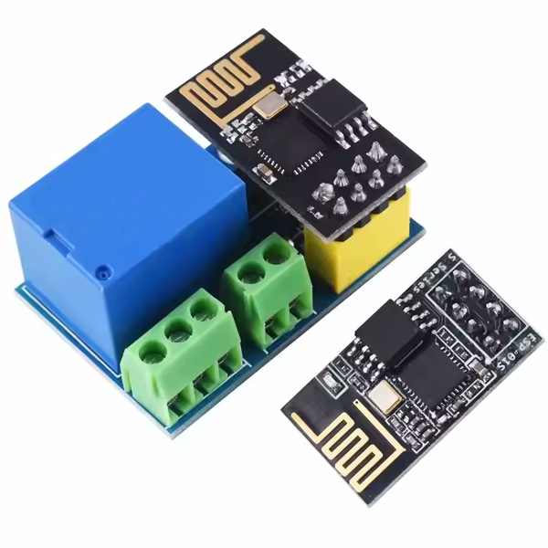

# ESP-01 Relay Control

This project integrates an **ESP-01 Relay Module** with a backend server written in **Kotlin**, using **Gradle** for build automation. It allows remote control of a relay via HTTP requests.

---

## Project Structure

- **`ESP01-RelayControl`**  
  Embedded firmware project developed using **CLion** and **PlatformIO**, responsible for managing the ESP-01 hardware and communicating with the server.

- **`relay-control-server`**  
  Kotlin-based backend application exposing a REST API for relay control. Built with **Ktor**, packaged as a `.war` file for deployment on servlet containers like **Apache Tomcat**.

- **`iot_led_action`**  
  Flutter application that connects to the backend and sends on/off commands to control the relay. 
---

## Features

- `GET /status`  
  Returns the current relay state (`true` or `false`) in JSON format.

- `POST /update`  
  Updates the relay state based on a JSON payload:
  ```json
  {
    "relay": true
  }
  ```

- Detailed request logging including client IP address.

---

## Technologies Used

- ESP-01 + Relay Module
- Kotlin + Gradle
- Ktor (Servlet-compatible via Tomcat)
- PlatformIO + CLion
- JSON serialization with kotlinx
- Apache Tomcat for server deployment

---

## Directory Overview

```plaintext
ESP01-RelayControl/         → Embedded firmware project
relay-control-server/       → Kotlin backend with REST API
```

---

## How to Run the Server

1. Build the `.war` file using Gradle:
   ```bash
   ./gradlew clean war
   ```

2. Copy the `.war` file to Tomcat's `webapps` directory:
   ```
   C:\Tomcat\webapps\
   ```

3. Start Tomcat and access the API:
   ```
   http://localhost:8080/status
   ```

---

## Hardware



---

## Author

**Clodoaldo Souza**  
Embedded systems and backend developer passionate about automation and remote control through software.

---
